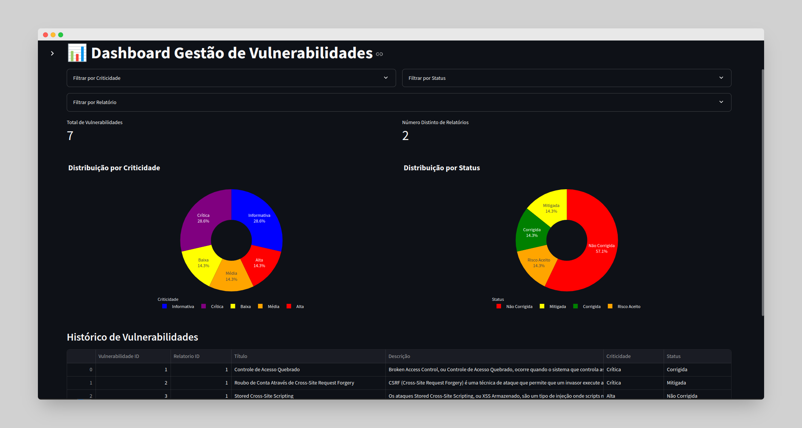

# Dashboard de gestão vulnerabilidades

Uma aplicação desenvolvida em Python, utilizando Streamlit para visualização de dados e bibliotecas adicionais para manipulação de dados em planilhas e gráficos.


## Requisitos

A aplicação requer Python 3.8 ou superior para funcionar corretamente. As dependências necessárias estão listadas no arquivo `requirements.txt`.

### Dependências principais:
- **Streamlit**: Utilizado para criar a interface web.
- **Pandas**: Usado para manipulação e análise de dados.
- **Plotly**: Para criação de gráficos interativos.
- **Openpyxl**: Para leitura de arquivos Excel.

## Instalação

### Passo 1: Clonar o repositório

```bash
git clone https://github.com/jeanrafaellourenco/dash-streamlit.git
cd dash-streamlit/
```

### Passo 2: Executar o script de setup

Certifique-se de que o script de setup instale todas as dependências corretamente, incluindo o ambiente virtual Python.

```bash
bash setup.sh
```

Este script fará as seguintes verificações e ações:
- Verificar se o Python 3.8 ou superior está instalado.
- Verificar e instalar o `pip`.
- Criar e ativar um ambiente virtual Python.
- Instalar as dependências listadas no arquivo `requirements.txt`.

Se houver algum problema com a versão do Python ou outras dependências, o script irá parar e fornecer mensagens de erro detalhadas.

### Passo 3: Executar a aplicação

Para rodar a aplicação, execute o seguinte comando:

```bash
bash run.sh
```

Este script ativa o ambiente virtual e inicia o servidor do Streamlit.

## Uso

A aplicação carrega dados a partir de arquivos Excel e exibe os resultados utilizando gráficos e tabelas interativas no navegador. Basta acessar a URL http://localhost:8501 após a execução do `run.sh`.

## Executando com Docker
### Passo 1: Build do Container
Se preferir utilizar Docker, você pode criar um container executando:

```bash
docker build -t dash-streamlit .
```
## Passo 2: Executando o Container
Depois de criar o container, execute-o com o seguinte comando:

```bash
docker run -p 8501:8501 --name dash-streamlit --rm dash-streamlit
```
Isso iniciará a aplicação no endereço http://localhost:8501.

## Observação
No diretório [app/](./app/) está o arquivo [vulnerabilidades_relatorios.xlsx](./app/vulnerabilidades_relatorios.xlsx) com alguns dados pré cadastrados. Basta excluir este arquivo para inicalizar um novo vazio.

## Contribuição

Sinta-se à vontade para contribuir com melhorias. Para isso, siga o fluxo de pull request e mantenha o código devidamente documentado.

## Licença

Esta aplicação está sob a licença [MIT license](https://github.com/jeanrafaellourenco/dash-streamlit?tab=MIT-1-ov-file).

---